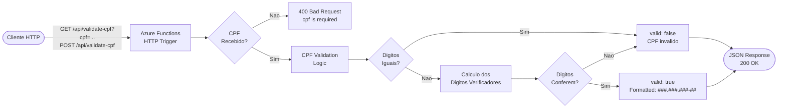

# Azure Serverless CPF Validator

<div align="center">

[](https://azure.microsoft.com/en-us/products/functions)
[](https://nodejs.org/)
[](https://developer.mozilla.org/en-US/docs/Web/JavaScript)
[](https://www.serverless.com/)
[](LICENSE)

Microsservico serverless para validacao de CPF usando Azure Functions | Serverless microservice for CPF validation using Azure Functions

</div>

---

## Fluxo da Arquitetura Serverless



---

## PT-BR - Portugues

### Sobre o Projeto

Este projeto implementa uma Azure Function HTTP Trigger que valida numeros de CPF (Cadastro de Pessoas Fisicas) brasileiros. A funcao recebe um CPF via requisicao HTTP e retorna se o CPF e valido ou invalido, aplicando o algoritmo matematico oficial dos digitos verificadores.

Desenvolvido como parte do desafio de projeto da trilha **Microsoft AZ-204** na plataforma [DIO](https://www.dio.me/).

### Tecnologias Utilizadas

| Tecnologia | Finalidade |
|---|---|
| **Azure Functions** | Plataforma serverless para execucao do microsservico |
| **Node.js** | Runtime JavaScript no ambiente de execucao |
| **JavaScript** | Linguagem de programacao da funcao |
| **HTTP Trigger** | Gatilho para acionamento via requisicoes REST |

### Funcionalidades

- Validacao matematica completa do CPF com calculo dos digitos verificadores
- Rejeicao automatica de CPFs com todos os digitos iguais (ex: 111.111.111-11)
- Suporte a API REST via HTTP GET e POST
- Resposta padronizada em formato JSON com CPF formatado
- Retorno de mensagens de erro descritivas para entradas invalidas

### Como Usar

#### Requisicao GET

```bash
GET /api/validate-cpf?cpf=12345678909
```

#### Requisicao POST

```bash
POST /api/validate-cpf
Content-Type: application/json
```

```json
{
  "cpf": "12345678909"
}
```

#### Resposta de Sucesso (CPF Valido)

```json
{
  "cpf": "12345678909",
  "valid": true,
  "formatted": "123.456.789-09"
}
```

#### Resposta para CPF Invalido

```json
{
  "cpf": "11111111111",
  "valid": false,
  "message": "CPF invalido"
}
```

#### Resposta para Requisicao Sem CPF

```json
{
  "error": "cpf is required"
}
```

### Estrutura do Projeto

```
azure-serverless-cpf-validator/
├── src/
│   └── functions/
│       └── validate-cpf.js       # Logica de validacao e handler HTTP
├── host.json                     # Configuracoes do Azure Functions host
├── package.json                  # Dependencias e scripts Node.js
├── LICENSE                       # Licenca MIT
└── README.md
```

### Executando Localmente

**Pre-requisitos:**

- [Node.js 18+](https://nodejs.org/)
- [Azure Functions Core Tools v4](https://learn.microsoft.com/en-us/azure/azure-functions/functions-run-local)

**Passos:**

```bash
# 1. Clone o repositorio
git clone https://github.com/galafis/azure-serverless-cpf-validator.git
cd azure-serverless-cpf-validator

# 2. Instale as dependencias
npm install

# 3. Inicie o servidor local
func start
```

A funcao ficara disponivel em: `http://localhost:7071/api/validate-cpf`

### Deploy no Azure

```bash
# 1. Autentique no Azure
az login

# 2. Crie um grupo de recursos
az group create --name rg-cpf-validator --location brazilsouth

# 3. Crie a conta de storage
az storage account create \
  --name stcpfvalidator \
  --resource-group rg-cpf-validator \
  --location brazilsouth \
  --sku Standard_LRS

# 4. Crie o Function App
az functionapp create \
  --resource-group rg-cpf-validator \
  --consumption-plan-location brazilsouth \
  --runtime node \
  --runtime-version 18 \
  --functions-version 4 \
  --name func-cpf-validator \
  --storage-account stcpfvalidator

# 5. Faca o deploy
func azure functionapp publish func-cpf-validator
```

---

## EN - English

### About the Project

This project implements an Azure Function with an HTTP Trigger that validates Brazilian CPF numbers (Cadastro de Pessoas Fisicas - individual taxpayer registry). The function receives a CPF via an HTTP request and returns whether the CPF is valid or invalid, applying the official mathematical algorithm for verification digits.

Developed as part of the project challenge for the **Microsoft AZ-204** track on the [DIO](https://www.dio.me/) platform.

### Technologies Used

| Technology | Purpose |
|---|---|
| **Azure Functions** | Serverless platform for running the microservice |
| **Node.js** | JavaScript runtime environment |
| **JavaScript** | Programming language for the function |
| **HTTP Trigger** | Trigger for invocation via REST requests |

### Features

- Complete mathematical CPF validation using the official verification digits algorithm
- Automatic rejection of CPFs with all identical digits (e.g., 111.111.111-11)
- REST API support via HTTP GET and POST methods
- Standardized JSON response including formatted CPF output
- Descriptive error messages for invalid or missing inputs

### How to Use

#### GET Request

```bash
GET /api/validate-cpf?cpf=12345678909
```

#### POST Request

```bash
POST /api/validate-cpf
Content-Type: application/json
```

```json
{
  "cpf": "12345678909"
}
```

#### Success Response (Valid CPF)

```json
{
  "cpf": "12345678909",
  "valid": true,
  "formatted": "123.456.789-09"
}
```

#### Response for Invalid CPF

```json
{
  "cpf": "11111111111",
  "valid": false,
  "message": "CPF invalido"
}
```

#### Response for Missing CPF

```json
{
  "error": "cpf is required"
}
```

### Project Structure

```
azure-serverless-cpf-validator/
├── src/
│   └── functions/
│       └── validate-cpf.js       # Validation logic and HTTP handler
├── host.json                     # Azure Functions host configuration
├── package.json                  # Node.js dependencies and scripts
├── LICENSE                       # MIT License
└── README.md
```

### Running Locally

**Prerequisites:**

- [Node.js 18+](https://nodejs.org/)
- [Azure Functions Core Tools v4](https://learn.microsoft.com/en-us/azure/azure-functions/functions-run-local)

**Steps:**

```bash
# 1. Clone the repository
git clone https://github.com/galafis/azure-serverless-cpf-validator.git
cd azure-serverless-cpf-validator

# 2. Install dependencies
npm install

# 3. Start the local server
func start
```

The function will be available at: `http://localhost:7071/api/validate-cpf`

### Deploy to Azure

```bash
# 1. Login to Azure
az login

# 2. Create a resource group
az group create --name rg-cpf-validator --location brazilsouth

# 3. Create a storage account
az storage account create \
  --name stcpfvalidator \
  --resource-group rg-cpf-validator \
  --location brazilsouth \
  --sku Standard_LRS

# 4. Create the Function App
az functionapp create \
  --resource-group rg-cpf-validator \
  --consumption-plan-location brazilsouth \
  --runtime node \
  --runtime-version 18 \
  --functions-version 4 \
  --name func-cpf-validator \
  --storage-account stcpfvalidator

# 5. Deploy the function
func azure functionapp publish func-cpf-validator
```

---

## License / Licenca

Este projeto esta licenciado sob a Licenca MIT. Consulte o arquivo [LICENSE](LICENSE) para mais detalhes.

This project is licensed under the MIT License. See the [LICENSE](LICENSE) file for details.

---

<div align="center">

Developed by [Gabriel Demetrios Lafis](https://github.com/galafis) | DIO Challenge - Microsoft AZ-204

</div>
